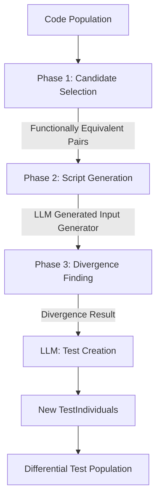

# Differential Test Population

The **Differential** population focuses on finding discrepancies between code individuals that are hypothesized to be functionally equivalent. By running two code versions against the same inputs and comparing their outputs, the system can discover edge cases where they diverge, which are then converted into new unit tests.

## Architecture & Discovery Pipeline

The discovery of differential tests follows a sophisticated 3-phase pipeline orchestrated by the `DifferentialDiscoveryOperator`.

## The 3-Phase Discovery Pipeline

### Phase 1: Candidate Selection

The `FunctionallyEqSelector` (selector.py) analyzes the current observation matrix to find groups of code individuals that behave identically across all currently known tests. It selects unexplored pairs from these groups as candidates for differential testing.

### Phase 2: Script Generation

For each selected pair, the `DifferentialLLMOperator` (operators/llm_operator.py) prompts an LLM to generate a Python script (`gen_inputs`). This script is designed to produce a diverse set of inputs (typical cases, edge cases, boundaries) specifically tailored to the problem description and the provided code.

### Phase 3: Divergence Finding

The `DifferentialFinder` (finder.py) executes the two candidate code snippets against the generated inputs in parallel sandboxes.

- If their outputs differ for a given input, a **divergence** is found.
- Each divergence results in two competing hypotheses: Code A is correct, or Code B is correct.
- Tests are then generated for these discrepancies and added to the population.

## Key Components

### 1. `DifferentialDiscoveryOperator` (operators/discovery.py)

The primary orchestrator that manages the transition between phases, maintains an `explored_pairs_cache` to avoid redundant work, and converts raw divergences into `TestIndividual` objects.

### 2. `DifferentialFinder` (finder.py)

The low-level execution engine that:

- Runs input generator scripts in a Python sandbox.
- Parallelizes the execution of code individuals in the target language sandbox using CPU workers.
- Identifies and packages output discrepancies as `DifferentialResult` objects.

### 3. `FunctionallyEqSelector` (selector.py)

Implements grouping logic to identify code individuals that currently "look" functionally equivalent based on their test pass/fail signatures.

## Directory Structure

- **types.py**: Core data structures (`DifferentialResult`, `FunctionallyEquivGroup`).
- **finder.py**: Multi-process engine for finding output discrepancies.
- **selector.py**: Logic for grouping code individuals by behavior.
- **profile.py**: Factory for creating the `TestProfile` and wiring the discovery pipeline.
- **operators/**:
  - **discovery.py**: The 3-phase pipeline orchestrator.
  - **llm_operator.py**: LLM services for generating input scripts and converting divergences to unit tests.
  - **initializer.py**: Basic initializer (often starts empty as discovery is dynamic).

## Logic Details

### Hypothesis Testing

When Code A and Code B diverge on an input, the system creates two new tests:

1. One that asserts `Output A` is correct for that input.
2. One that asserts `Output B` is correct for that input.
The Bayesian update mechanism in the orchestrator then naturally settles on the correct test as it observes which code individuals (and eventually the ground-truth public tests) agree with which result.
