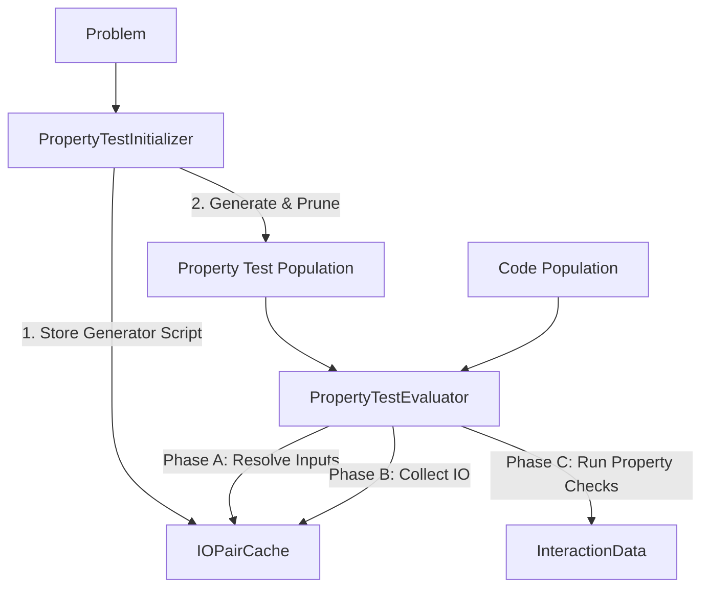

# Property Test Population

The **Property** population consists of individuals that define invariant properties or invariants that a correct solution must satisfy. Unlike unit tests which check for specific output equality, property tests are Python functions that take an `(input_arg, output)` pair and return `True` if the property holds.

## Architecture & Data Flow



### Data / Execution Flow Diagram

```text
INITIALISATION (gen 0) — PropertyTestInitializer.initialize(problem)
─────────────────────────────────────────────────────────────────────
  problem.question_content
  problem.starter_code
         │
         ├─▶ LLM call 1 (gen_inputs.j2):
         │     question_content → Python input-generator script
         │     validate Python syntax
         │     IOPairCache.store_generator_script(script)
         │
         └─▶ Two-Stage Generation (Property Tests):
               1. LLM call 2 (describe_properties.j2):
                  Generate list of property descriptions.
               2. Parallel LLM call 3 (convert_description_to_property.j2):
                  Spawn threads to write implementations for those properties.
               │
               ▼ [Pruning — Python sandbox only]
               for each property test:
                 for each (input, output) in problem.public_test_cases:
                   run: property_<name>(input_arg=input, output=output) → True/False
                 reject if any False
               │
               ▼
  list[TestIndividual]  →  property TestPopulation (gen 0)


EACH EPOCH — PropertyTestEvaluator.execute_tests(code_pop, property_test_pop)
─────────────────────────────────────────────────────────────────────
  Phase A — resolve inputs (once per problem, cached)
         IOPairCache.get_generated_inputs() → empty on first call
         → run generator_script in PYTHON sandbox
         → parse stdout → list[str] of input_arg strings
         → IOPairCache.store_generated_inputs(inputs)

  Phase B — populate (input, output) pairs for new code individuals
         for each code_individual not yet in IOPairCache:
           for each input_arg in inputs:
             compose_evaluation_script(code_snippet, input_arg)
             run in TARGET-LANGUAGE sandbox → actual_output
           IOPairCache.store(code_id, [IOPair(input_arg, actual_output), ...])

  Phase C — evaluate property tests
         for each (code_ind, property_test_ind):
           pairs = IOPairCache.get(code_id)
           for each pair:
             compose Python script:
               property_snippet + call(input_arg, output)
             run in PYTHON sandbox → True / False / error
           all True  → status="passed",  error_log=None,           matrix[i,j] = 1
           any False → status="failed",  error_log=structured_log, matrix[i,j] = 0
           any error → status="error",   error_log=traceback,      matrix[i,j] = 0
           (structured_log lists each failing (input_arg, output) pair)
         │
         ▼
  InteractionData  →  Bayesian belief update
                      (same as unittest / differential)
```

## Key Components

### 1. `IOPairCache` (types.py)

A central, thread-safe store responsible for:

- **Input Generator Script**: Stored by the initializer, used by the evaluator.
- **Generated Inputs**: Cached list of raw input strings produced by the generator.
- **Per-Code IOPairs**: A mapping of `code_id` to its actual `(input, output)` pairs.

### 2. `PropertyTestInitializer` (operators/initializer.py)

Initiates the population using a two-stage process:

1. **Input Generator Generation**: LLM generates a Python script designed to produce diverse and valid test inputs (`gen_inputs.j2`).
2. **Two-Stage Property Generation**:
   - **Stage 1 (Description)**: LLM brainstorms high-level property descriptions (`describe_properties.j2`).
   - **Stage 2 (Implementation)**: Descriptions are converted into executable Python snippets in **parallel** using a thread pool (`convert_description_to_property.j2`).
3. **Public IO Pruning**: Every candidate property test is immediately validated against known-correct public test cases. If it returns `False` or crashes on any public IO, it is discarded.

### 3. `PropertyTestEvaluator` (evaluator.py)

Implements the `IExecutionSystem` interface through a three-phase loop:

- **Phase A (Input Resolution)**: Runs the cached generator script in a Python sandbox to obtain an input list (cached for the problem lifecycle).
- **Phase B (IO Collection)**: Executes each code individual against the generated inputs in the target language to collect raw stdout (`actual_output`). This is parallelized across CPU workers.
- **Phase C (Property Evaluation)**: Evaluates each property test against the collected IOPairs in a Python sandbox. A code individual passes if all properties return `True` for all inputs.

## Directory Structure

- **types.py**: Core data structures (`IOPair`, `IOPairCache`).
- **evaluator.py**: The `PropertyTestEvaluator` implementation and multiprocessing workers.
- **profile.py**: Factory for creating the `TestProfile` and wiring dependencies.
- **operators/**:
  - **initializer.py**: The two-stage, thread-parallel initializer.
  - **validator.py**: Shared logic for pruning snippets against public test cases.
  - **noop.py**: A no-op operator used when offspring generation is disabled.

## Logic Details

### Snippet Signature

All property tests must follow this signature:

```python
def property_name(input_arg, output):
    # input_arg is a dictionary of arguments
    # output is the raw return value
    # return True if holds, False otherwise
    ...
```

### Pruning & Validation

Pruning is performed during initialization. The `validate_property_test` helper ensures that the snippet:

1. Is syntactically valid Python.
2. Returns `True` for all public test cases provided in the `Problem` definition.
3. Does not crash during execution.
