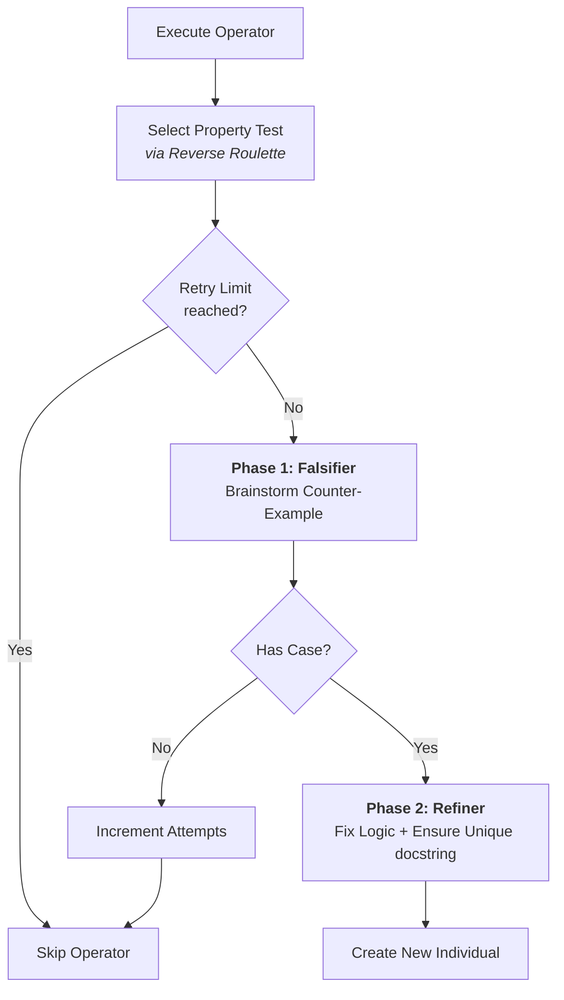

# Adversarial Property Refiner

The `AdversarialPropertyRefiner` is a specialized evolutionary operator for the **Property Population**. It uses a two-phase LLM-based process (similar to CEGIS - Counter-Example Guided Inductive Synthesis) to fix property tests that are too restrictive (false positives).

## Overview

In property-based co-evolution, property tests can sometimes be "buggy"—they might reject perfectly valid solutions because the property logic is slightly incorrect or too narrow. This operator identifies those flaws by:

1. Finding a **counter-example**: A valid (input, output) pair that the property incorrectly rejects.
2. **Refining** the property: Using the counter-example and reasoning to broaden or correct the property logic.

---

## Multi-Phase Workflow

The operator executes in two distinct LLM calls to ensure high-quality reasoning and robust fixes.

### Phase 1: Falsification (Counter-Example Generation)

The LLM acts as an "adversary." It looks at the current property snippet and tries to find a case where the property returns `False`, but the actual problem constraints imply it should be `True`.

- **Input**: Problem description, Starter code, current property snippet.
- **Output**: `<reasoning>` explaining the flaw + `<counter_example>` (JSON data).
- **Retry Logic**: If the LLM fails to find a counter-example (e.g., the property is actually correct), we increment a `falsification_attempts` counter in the individual's metadata. We give up after 3 failed attempts to avoid wasting tokens on robust properties.

### Phase 2: Refinement

The LLM uses the reasoning and counter-example from Phase 1 to write a corrected version of the property function.

- **Refinement**: Fixes the logic so the counter-example now returns `True`.
- **Orthogonality**: The LLM is provided with a list of "Existing Property Intentions" (docstrings from other individuals) and is instructed to ensure the new property checks a unique aspect to maintain population diversity.
- **Self-Documentation**: The operator extracts the **docstring** from the refined snippet and saves it as the individual's `explanation`.

---

## 📊 Process Diagram



---

## Selection Strategy: Reverse Roulette

To maximize efficiency, the refiner uses **Reverse Roulette Wheel Selection**.
Properties with **lower belief scores** (meaning they are failing on many valid code solutions or haven't been well-validated) are given a **higher probability** of being selected for refinement.

---

## Example Transition

**Original (Too Restrictive)**:

```python
def property_sum_is_greater(input_arg, output):
    """Checks if sum is greater than inputs."""
    return int(output) > input_arg['x'] and int(output) > input_arg['y']
```

*Rejected by falsifier because `x=0, y=0` results in `0`, and `0 > 0` is `False`.*

**Refined**:

```python
def property_exact_arithmetic_sum(input_arg, output):
    """
    Verifies that the output is exactly the arithmetic sum of x and y.
    This handles zero and negative integers correctly.
    """
    return int(output) == input_arg['x'] + input_arg['y']
```

---

## Configuration

| Parameter | Default | Description |
|-----------|---------|-------------|
| `max_falsification_attempts` | 3 | Number of times we try to find a counter-example before giving up on a specific individual. |
| `parent_selector` | `ReverseRoulette` | Logic used to pick which property to fix. |
