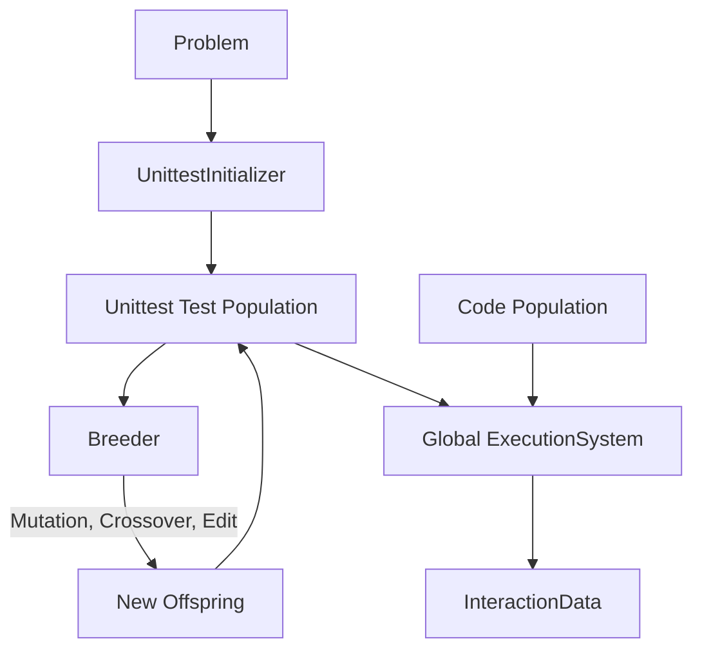

# Unittest Population

The **Unittest** population consists of standard unit tests (e.g., Assertions in the target language). These tests are evolved over time to improve their ability to distinguish between correct and incorrect solutions.

## Architecture

The unittest population follows a standard evolutionary lifecycle, integrated with the global `ExecutionSystem`.

## Key Components

### 1. `UnittestInitializer` (operators/initializer.py)

Creates Gen-0 test individuals via LLM.

- **One-Shot Generation**: Asks the LLM for the target population size of tests in a single call (`initial.j2`).
- **Graceful Recovery**: Automatically handles under-generation by making additional "top-up" LLM calls and trims over-generation to match the exact `initial_population_size`.
- **Parsing**: Extracts test functions from code blocks and ensures they are syntactically valid.

### 2. Evolutionary Operators (operators/)

The population size is maintained through three primary operators:

- **Mutation (`mutation.py`)**: Perturbs a single test function to explore new boundary conditions or logic paths.
- **Crossover (`crossover.py`)**: Combines logic from two parent test functions to create a new offspring.
- **Edit (`edit.py`)**: Performs more structural modifications or refinements to an existing test function.

### 3. Selection Strategy

- **`TestDiversityEliteSelector`**: Selects the next generation's survivors by balancing individual scores (Bayesian beliefs) with their contribution to overall population diversity (via the observation matrix).

## Directory Structure

- **profile.py**: Factory for creating the `TestProfile`, wiring the `Breeder`, `Initializer`, and `EliteSelector`.
- **operators/**:
  - **initializer.py**: LLM-based population initialization.
  - **mutation.py**, **crossover.py**, **edit.py**: Evolutionary operators.
  - **_helpers.py**: Shared utilities for test extraction and LLM interaction.

## Logic Details

### Snippet Content
Unittest snippets are always written in the target language (e.g., Python, Ballerina) and represent one or more test functions that can be executed by the language-specific runner.

### Scoring
Individual "probabilities" (beliefs) are updated based on their ability to refute incorrect code individuals and confirm correct ones, using Bayesian updates during the orchestrator's epoch loop.
